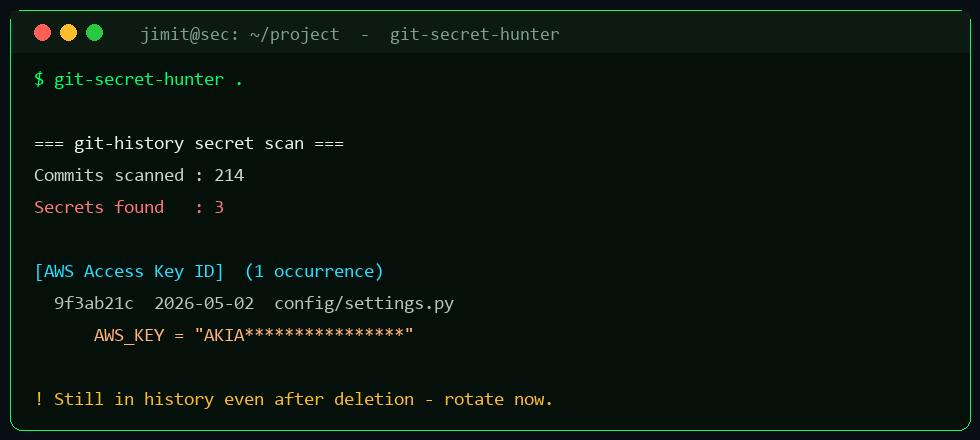

# git-secret-hunter

[](https://www.python.org)


Scan a git repository's **entire commit history** (all branches) for leaked secrets —
API keys, tokens, private keys, passwords, connection strings.

**Why history, not just current files?** A secret you committed and later "removed" is
**still in your git history** — anyone who clones the repo can recover it. Deleting the
line does *not* fix the leak. This tool finds those, so you know what to **rotate**.

Pure standard library (drives the system `git`). Python 3.8+ · GUI + CLI.



---

## Install & run

```bash
# CLI (from anywhere)
python -m gitsecrets                 # scan the repo in the current directory
python -m gitsecrets /path/to/repo
python -m gitsecrets . --max 500     # only the 500 most recent commits
python -m gitsecrets . --exit-code   # exit 1 if any secret found (CI / pre-commit)

# GUI
python gitsecrets/gui.py             # or double-click run.bat

# install (adds the `git-secret-hunter` command)
pip install -e .
```

## Example

```
=== git-history secret scan: . ===
Commits scanned : 214
Secrets found   : 3

[AWS Access Key ID]  (1 occurrence(s))
  9f3ab21c  2026-05-02  config/settings.py
      AWS_KEY = "AKIA................"

! These secrets remain in git history even if deleted from current files.
  Rotate them, and consider rewriting history (git filter-repo).
```

## What it detects
AWS keys, Google API keys, GitHub tokens (classic + fine-grained), Stripe/Twilio/SendGrid
keys, Slack tokens & webhooks, private-key blocks, JWTs, generic `api_key/secret/token`
assignments, hard-coded passwords, and passwords in connection strings. De-duplicates by
secret value and skips minified/lockfile/binary paths.

## Use in CI (fail the build on a leak)
```yaml
- run: pip install git-secret-hunter && git-secret-hunter . --exit-code
```

## Responsible use
Scan repositories you own or are authorized to audit. **If it finds a real secret, rotate
it immediately** — removing it from the current file is not enough.

## ⬇️ Download & Install

**This is a public tool — download and use it on your device for free.**

```bash
# 1) Clone it
git clone https://github.com/JIMIT-PARIKH-01/git-secret-hunter.git
cd git-secret-hunter

# 2) ...or download a ZIP (no git needed)
#    https://github.com/JIMIT-PARIKH-01/git-secret-hunter/archive/refs/heads/main.zip

# 3) ...or install the command straight from GitHub
pip install git+https://github.com/JIMIT-PARIKH-01/git-secret-hunter.git
```

Then run it as shown in the usage section above (CLI `python -m ...`, or launch
the GUI via `run.bat`).

<details>
<summary><b>🔒 Requesting access to a private tool</b></summary>

Public tools install with the commands above. If a tool is **private**, access
is granted by the owner through GitHub — a static link cannot unlock private
code, only GitHub can:

1. **Request access** — open an [access request](https://github.com/JIMIT-PARIKH-01/JIMIT-PARIKH-01/issues/new?template=tool-access-request.md&title=Access+request:+git-secret-hunter) or message on
   [LinkedIn](https://www.linkedin.com/in/jimit-devangkumar-parikh/).
2. The owner reviews it and, if approved, **adds you as a collaborator** on the
   private repository.
3. GitHub then lets you clone / download it with your own account. Access is
   revoked the moment the owner removes you as a collaborator.

</details>

## License
MIT — see [LICENSE](./LICENSE).
